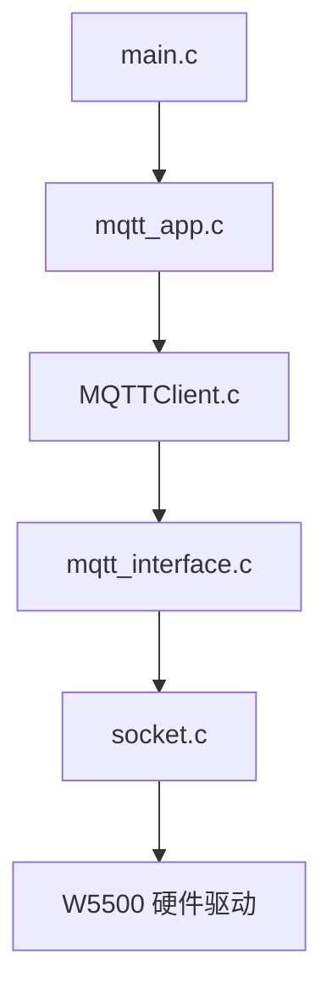

# W5500 第三阶段：MQTT 通信应用 (01_库文件准备与工程结构)

## 1. MQTT 库文件路径
WIZnet 的 `ioLibrary_Driver` 已经集成了 Paho MQTT 的 C 语言客户端。请确保您的工程目录中包含以下结构：

```text
ioLibrary_Driver/Internet/MQTT/
├── MQTTPacket/src/        # MQTT 报文编码/解码核心库
│   ├── MQTTConnect.h
│   ├── MQTTConnectClient.c
│   ├── MQTTPacket.c
│   └── ...
├── MQTTClient.c           # Paho MQTT 客户端核心逻辑
├── MQTTClient.h
├── mqtt_interface.c       # WIZnet 封装的硬件接口层 (关键移植点)
└── mqtt_interface.h
```

---

## 2. 工程包含路径 (Include Paths)
在 Keil 或其他 IDE 中，必须将以下路径加入头文件包含列表：
- `ioLibrary_Driver/Internet/MQTT`
- `ioLibrary_Driver/Internet/MQTT/MQTTPacket/src`

---

## 3. 应用层文件组织
为了保持代码整洁，建议在 `BSP/` 目录下创建专门的应用处理文件：
- `BSP/mqtt_app.c`：负责 MQTT 的初始化、连接状态机和业务逻辑。
- `BSP/mqtt_app.h`：暴露初始化和循环处理接口。

---

## 4. 文件依赖关系图


---

## 5. 准备工作检查
- [ ] 已确认 `ioLibrary_Driver` 文件夹完整。
- [ ] 工程已成功包含 MQTT 相关头文件路径。
- [ ] 已在 `main.c` 中引用了 `mqtt_app.h`。
