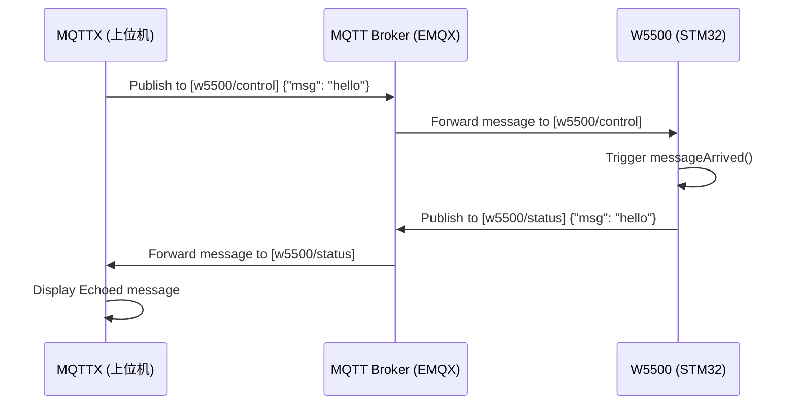

# W5500 第三阶段：MQTT 通信应用 (04_数据回传_Echo功能验证)

## 1. 为什么实现 Echo 功能？
Echo（数据回传）是验证双向通信最直接的方法。当 W5500 收到一条消息时，将其原样（或稍作修改）发回给发送方。

---

## 2. 步骤 A：实现 `messageArrived` 回调
每当 W5500 收到订阅主题（如 `w5500/control`）的消息时，库会自动调用此函数。

```c
void messageArrived(MessageData* md) {
    MQTTMessage* message = md->message;
    
    // 1. 打印接收到的数据
    printf("Topic: %.*s, Payload: %.*s\r\n", 
           md->topicName->lenstring.len, md->topicName->lenstring.data,
           (int)message->payloadlen, (char*)message->payload);

    // 2. 数据回传逻辑 (Echo)
    MQTTMessage pub_msg;
    pub_msg.qos = QOS0;
    pub_msg.retained = 0;
    pub_msg.dup = 0;
    pub_msg.payload = message->payload; // 将收到的 payload 发回
    pub_msg.payloadlen = message->payloadlen;
    
    // 3. 发布到状态主题
    MQTTPublish(&c, "w5500/status", &pub_msg);
    printf("Echo sent to topic: w5500/status\r\n");
}
```

---

## 3. 步骤 B：订阅主题
在 `mqtt_init` 中成功连接后，必须订阅一个主题来监听指令：

```c
MQTTSubscribe(&c, "w5500/control", QOS0, messageArrived);
```

---

## 4. 数据流分析 (Echo 流程图)


---

## 5. 验证点
- [ ] 串口打印接收到的 Topic 名称。
- [ ] 串口打印接收到的 Payload 内容。
- [ ] 串口显示 `Echo sent to topic: w5500/status`。
- [ ] MQTTX 客户端收到了回传消息。
